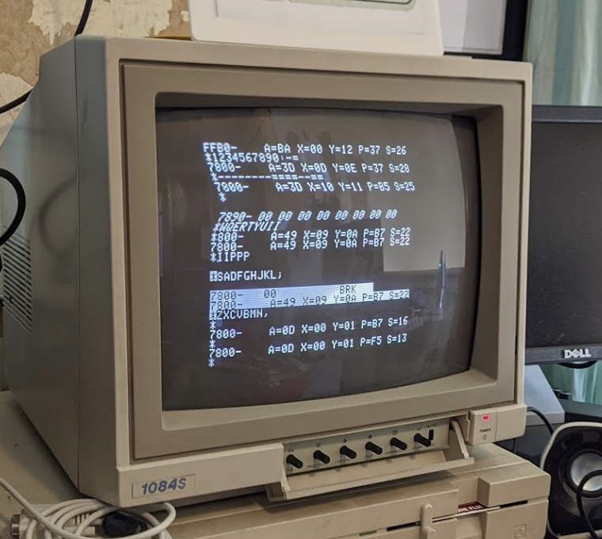
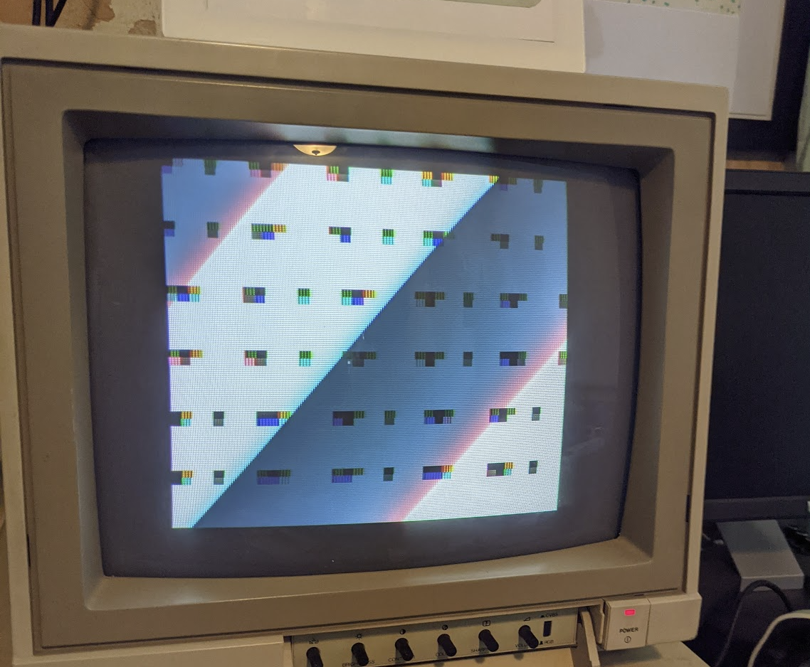
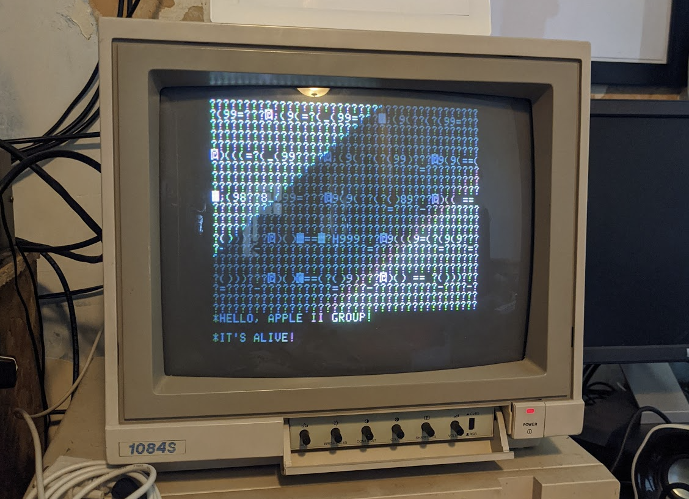
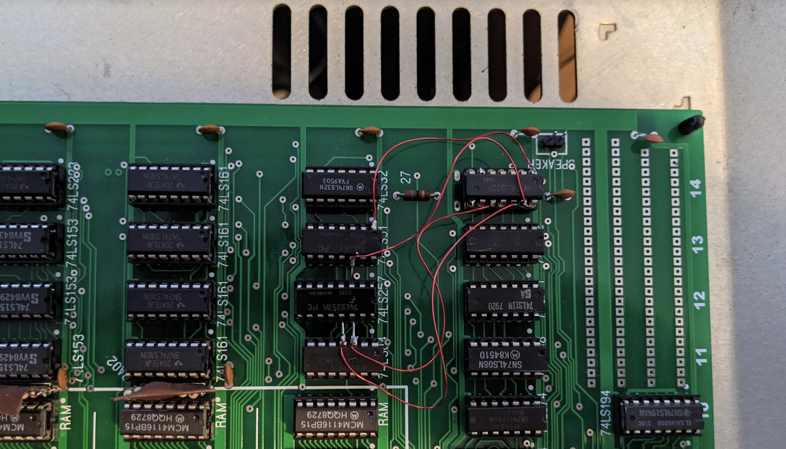
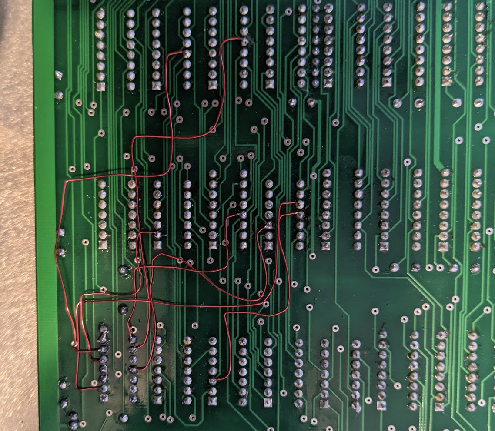

# Apple II - Rev 0 video sync fix

This describes the fixes I made to my Apple II rev0 replica.

## Background

The rev0 video generation is pretty dirty and was fixed in subsequent
motherboard revisions.

Here's how it looks on my 1084S before the mod:

And here's how it looks afterwards!

This is based on Mike Willegal's work [Here](https://www.willegal.net/appleii/applesync.htm).  The schematic changes work fine, but the instructions are
a little difficult to follow if you can't follow schematics very well.

So, here's the list of things to do:

### Preparing the board

 * Lift C11 (74LS04) and C13 (74LS51)
 * Install a 14-pin socket at B14 for a 74LS02 (quad NAND gate), with
   pin 1 lined up to pin 1 (and thus two empty pins where pins 8/9 would
   be)
 * Bend pins 1 and 12 out on C13 (74LS51)
 * Bend pins 3 and 4 out on C11 (74LS04)
 * Short pin 7 on B14 to pin 8 - the socket at B14 is for a 16 pin DIP,
   you've installed a 14 pin DIP socket, so this connects ground from pin
   8 to the IC ground on pin 7.
 * Short pin 3 and 4 on B14 - this links the output of one gate to the
   input of the other gate.

### Wiring the top of the board

There are four wires to place on the top of the board.  These go
between the lifted up pins on C11/C13 to the newly installed IC at B14.

 * C13 (74LS51) pin 1 to B14 pin 1
 * C13 (74LS15) pin 12 to B14 pin 13
 * C11 (74LS04) pin 3 to B14 pin 10
 * C11 (74LS04) pin 4 to B14 pin 12

Here's how mine looks after the top wires are done:

### Wiring the bottom of the board

Now, the rest of the wires are on the bottom of the board.
This gets a bit tricky because the top has the silk screening, so
I suggest you use a sharpie to mark the following ICs:

 * B12, B14
 * C11, C12, C13
 * D12, D13

Then the wiring is what's on the "improved video generation mod",
but as I said above, unless you're paying attention to the schematic
you may not realise there's one wire between gates you need to make
on the bottom of the board!

So!  The new signaling wires needed are:

  * C11-3 to B14-11
  * C12-13 to B14-8
  * D12-12 to B14-9
  * B12-3 to C11-11
  * C13-2 to B14-5
  * D13-13 to B14-6

Then, you need one final wire to link:

 * C11-10 to B14-2

This is a spare NOT gate in C11 on the Rev0 board that is pressed into
service here.

And, that's it! Now the picture quality should be markedly better!

Here's how the bottom of my board looks after the mod:

