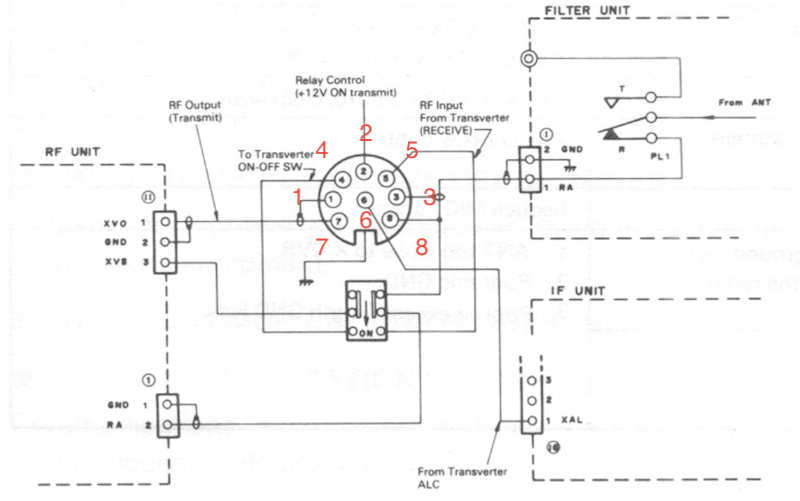

# Kenwood TS-430S

This is a collection of notes on the care and feeding of a TS-430S.

## Overview

## Common Issues

Like the TS-440S, the TS-430S suffers from a set of pretty common problems.
Yes, this is kinda similar to the TS-440S notes!

### Dry Joints

There are very likely dry joints everywhere.  This seems to be some weird
combination of perhaps some early automated soldering and a whole lot of
a lack of solder being used.  In a lot of cases I've seen barely enough
solder on each pad and it cracks very very easily.  A lot of repairs can
be summarised as "take out each board, touch up every joint."

### Finals

The finals are either in great shape or someone's run the rig into the ground.
I always pull out the LPF output filter and finals board for inspection.
I'll always touch up the soldering on the finals board - especially around all
the transistors on the board.  A fresh coat of thermal grease is also a great idea.

### RF Board Repair/Alignment

The RF is also pretty straight forward.  The service manual goes into good
detail about what to do here.  The interesting thing to note is that the
bandswitching control wiring to the low-pass filter board and the ACC jack
passes through here.  So, if you're seeing weirdness with the LPF behaviour,
I'd recommend taking a meter to the LPF related connections and see what's
going on.

### PLL Board Repair/Alignment

The PLL board is relatively straight forward.  If there's the sonybond
stuff on the board then you should remove it or it'll eventually dry up
and stop things from working.

Pay close attention to the TTL ICs - you need to get the right replacements
in order to meet speed requirements.  Eg replacing them with 74LS chips
will cause the PLL to fail because it can't keep up with the PLL loop
frequency.

### Control Board Repair/Alignment

(tbd)

### USB/SSB frequency response, IF offset Alignment

Like a lot of non-computer rigs before it, the TS-430S has separate oscillators
for LSB, USB and CW.  AM and FM are derived from the CW oscillator.

IF offset alignment is mostly about getting the 8.83MHz oscillator working right.

### FM calibration

The FM calibration does not really match what's in the service manual.
When hitting "transmit" the carrier output on Control board connector #3
doesn't output anything! Instead, the carrier is generated and modulated
directly on the FM-430 board itself.

The FM-430 board has an 8.8315MHz crystal (X1) and a trimmer capacitor
(TC1) which forms the FM carrier. This is output connector #2 to the
IF board - so you can check if the frequency is OK by putting
an oscilloscope on Pin 1 of connector #2 (FMT, FM transmit carrier.)
Assuming no modulation input, it should give a steady enough carrier
to calibrate against.

TBD - figure out what TC5 is on the control board. It may also be used
for AM...

### Bypassing the finals for output alignment

Whilst on the topic of output alignment - here's something I commonly do.
Unless you need to test something like the finals or ALC, you can just
take the RF output from the RF board, put it into a 56 ohm resistor and
put a scope across that.  I'll do this for testing things like the above
USB/SSB frequency response, frequency calibration, output carrier cleanliness,
modulation, etc - none of these require full output power or ALC to work.
It saves a bunch of headache around things around having to output real RF
power just to check things - so you don't have to worry about how long
you leave your radio on and transmitting whilst aligning the VCOs/PLLs.

## Using the transverter socket

The transverter socket is rather nifty on this radio. I do need to do some
measurements to figure out how strong the signal gets without ALC feedback
to make sure it doesn't distort at some point.

Note that the pinout here is NOT the same as the normal 8 pin DIN layout
you can find on the internet.

Here's a snippet from the service manual - this is the pin layout on the
rear socket, as if you're looking AT the female end of the socket that
you plug into.

Here's the pinout with a decent description.

 * Pin 1 Earth
 * Pin 2 PTT: +12volt on TX. low current (ie, don't drive a relay, drive a transistor.)
 * Pin 3 Earth
 * Pin 4 TX 100w PA disable. Active low (ie, connect to earth to disable PA.)
 * Pin 5 RX input from transverter IF RX output.
 * Pin 6 ALC input.
 * Pin 7 TX out to transverter. Low power approx 10mW output.
 * Pin 8 HF RX ant out. Loop in to pin 5 to bypass the transverter and work on HF.

This allows a TS-430S to be used for both HF and for transverter operation:

 * With the transverter off or in bypass mode, don't connect pin 4 to ground (which
   allows the PA output) and loop pin 5 to pin 8 to allow the HF SO-239 input to
   connect to the RF board RX input.

 * To use the transverter, ground pin 4 (to disable the PA when transmitting);
   disconnect pin 8 (so you don't use the HF SO-239 input); TX signal is on pin 7
   and feed RX signal in on pin 5.  Use pin 2 for PTT to the transverter.

There are some notable limitations/gotchas!

 * The transverter output does bypass the TX inhbit signal from the control
   board, and provide continuous output from 100KHz to 30MHz.
 * Notably, signals below around 1MHz start looking distorted
   and have unwanted higher frequency harmonics involved.
   It may need extra filtering before feeding into the transverter.

For my initial experiments on 630m, I did the following:

 * Disconnect J9, so the TX finals bias is not ever asserted.
 * Disconnect J10, so the TX inhibit signal is not ever asserted.
 * Snip D39 so transmit (now only out the transverter board) from
   0->1.6MHz is available.
 * Add a 50 (ok, 56 ohm) terminator inside the radio on the TX drive
   output so I wouldn't drive an open circuit when not driving the
   transverter output.

I think I'll need a 630m bandpass filter on the transverter TX output.

### AM receive frequency response

One of the advantages of a general coverage receiver is the ability to listen to
short-wave broadcasters from around the world on AM. The TS-430 gives a very good
performance with the optional AM filter, but the bass response is poor, which
is unfortunate if you are listening on a large speaker. To improve the bass response,
locate the IF Unit and increase C45 (.047mF) to a l0mF tantalum then increase C57
from 0.47 mF to 2.2 mF. You can strap the new components in parallel with the
existing ones. Watch the polarity on electrolytic capacitors!
This modification also makes it easier to tune carriers to zero-beat
against the BFO on SSB.

## Broadcast band AM attenutation

Finally, there is one other source of quality AM signals, and that is the
standard AM broadcast band of 540 to 1590 kHz. In my TS-430, the sensitivity
dropped considerably when tuning between 500 kHz and 1600 kHz.Apart from
making distant AM broadcasts inaudible, this also spoils reception of NAVTEX
navigational telex transmissions on 518 kHz. The cause was the attenuator
circuit in the RF unit's 0.5-1.6 MHz bandpass filter; although the circuit
says R7 should be 22W , a 220W resistor had been installed.
Bridging this resistor with 27W improved the sensitivity to a very
respectable level, and there is almost no change now in S-meter
reading as the dial is tuned past 500 or past 1600 kHz.

## PDFs

This is a collection of versions of user manauls and service manuals.

 * [TS-430.pdf](TS-430.pdf)
 * [ts430s_manual.pdf](ts430s_manual.pdf)
 * [TS430S_user.pdf](TS430S_user.pdf)
 * [ts430s-service-manual.pdf](ts430s-service-manual.pdf)

## High-resolution schematics

(tbd)

