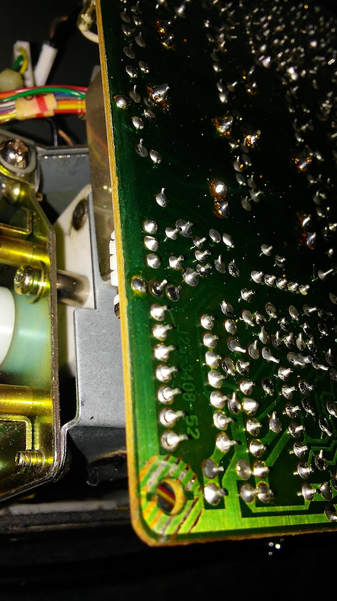

# Kenwood TS-440S

I've been cutting my teeth on solid state HF radios by learning to repair
and align a TS-440S.  I've repaired half a dozen of these so far including
a couple for friends.

## Overview

They're a pretty solid radio for the time.  Outside of the usual unobtainable
silicon parts these days and IF transformers you'd have to rewind yourself to
repair, the TS-440S holds up pretty well as a repairable 1980's HF rig.

I've had no issues sourcing replacement parts, including cannibalising older
boards for components.  However, the risk I have is that unless a radio is
completely dead or disassembled, I've had a pretty damned good success rate
at taking a broken radio and making it squeak again.  As of 2018, ebay is
your friend.

It sports a pair of finals transistors on a rather oversized aluminium heatsink
which according to the user manual can do full keydown carrier for an hour
before a 45 minute downtime.  It's quite possible with even further cooling
one could run the radio for longer duty cycles.  I use it quite extensively
for 95W digital modes and once restored well, a TS-440S could do FT8 or
JT65 for hours at a time without breaking a sweat.

## Common Issues

There are a slew of websites covering a variety of TS-440S modifications and
issues.  I'll start tallying some soon - but for now, here's a shortlist of
things I've noticed that need to be addressed.

### Dry Joints

There are very likely dry joints everywhere.  This seems to be some weird
combination of perhaps some early automated soldering and a whole lot of
a lack of solder being used.  In a lot of cases I've seen barely enough
solder on each pad and it cracks very very easily.  A lot of repairs can
be summarised as "take out each board, touch up every joint."

### Finals

The finals are either in great shape or someone's run the rig into the ground.
I always pull out the LPF output filter and finals board for inspection.
I'll always touch up the soldering on the finals board - especially around all
the transistors on the board.  A fresh coat of thermal grease is also a great idea.

There's a temperature sensor on one of the finals transistors but it isn't
physically attached to it - it's held in place by a combination of bent
leads and tucking it underneath a diode.  It's .. not always very structurally
stable.  I highly recommend bending the thermistor leads back more so it
pushes more firmly up against the finals transistor and then tucking it
under the diode.

### Computer Control

Just source the two ICs - one is a CMOS logic device and the other is a UART.
It's easy to install it and it's very easy to build a suitable cable.
Note the output is inverted - making it hard to hook into a 5v FTDI chip but
super easy to hook into optoisolators which then you run into the FTDI chip.

(TBD - just post a circuit diagram about it!)

### VCO1 Repair/Alignmen

(tbd)

### VCO5 Repair/Alignment

(tbd)

### RF Board Repair/Alignment

(tbd)

### PLL Board Repair/Alignment

(tbd)

### USB/SSB frequency response, IF offset Alignment

Here's a fun one.  If you read the service manual you'll find there's a section
in the alignment chapter on the USB/SSB frequency response - and a set of 10
DIP switches to set.  This is used to set the USB and SSB frequency response
using a two-tone AF generator and a scope.

Now, what this implies is that there's a somewhat tight coupling between
the IF/RF boards that have SSB filters on them, and the control/CPU board
with those DIP switches.

If they're set wrong, then you end up with two things:

 * Your frequency response is way off, and things will sound terrible on
   transmit/receive; and
 * You won't be able to correctly centre align the IF Offset adjustment
   alignment!

So if you've gone and switched out your IF board, (or maybe your RF board,
be careful) or the Control/CPU board you will have to do this realignment.
It's not too bad - just make up a cable from your computer to the AFSK
input jack (with a suitable attenuator so you don't distort things),
hook up the output to a scope via a suitable dummy load and directional
coupler/attenuator and do it!

### Bypassing the finals for output alignment

Whilst on the topic of output alignment - here's something I commonly do.
Unless you need to test something like the finals or ALC, you can just
take the RF output from the RF board, put it into a 56 ohm resistor and
put a scope across that.  I'll do this for testing things like the above
USB/SSB frequency response, frequency calibration, output carrier cleanliness,
modulation, etc - none of these require full output power or ALC to work.
It saves a bunch of headache around things around having to output real RF
power just to check things - so you don't have to worry about how long
you leave your radio on and transmitting whilst aligning the VCOs/PLLs.

### Electronic hum always being present!

So this is a fun one.  There's a three-wire cable running from the IF board to
under the PLL board area where the optional VS-1 (voice synthesis) unit lives.
However, this isn't a shielded or terminated wire - so it picks up all kinds
of electrical noise from the PLL board if the VS-1 isn't connected.

You can hear the electrical noise even with the volume turned down - the
VS-1 level is independent of the volume control, similar to the control
beeps.

I recommend getting a 56 ohm resistor and putting it between the sound and
ground pins on that connector.  Be sure you're not putting it against the +ve
rail pin - it'll make the resistor unhappy.  That will ground the cable
a little and prevent it from being such an open-ended antenna.

## PDFs

 * [TS-440S_service_manual.pdf](TS-440S_service_manual.pdf)
 * [TS-440.pdf](TS-440.pdf)j
